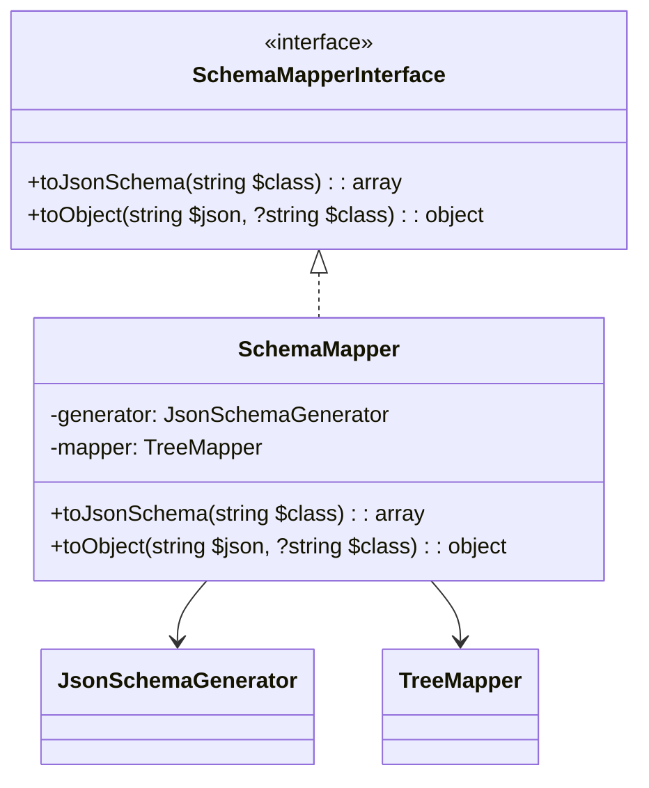

# JSON Schema Mapper for LLM Agents

[](https://packagist.org/packages/llm-agents/json-schema-mapper)
[](https://packagist.org/packages/llm-agents/json-schema-mapper)
[](https://packagist.org/packages/llm-agents/json-schema-mapper)

This package is a super handy JSON Schema Mapper for the LLM Agents project.

## What's it all about?

This package gives you a nifty SchemaMapper that can:

- Convert PHP classes to JSON schemas
- Turn JSON data into PHP objects

## Class Diagram

Here's a quick look at how the main components fit together:



## Getting Started

### Installation

First things first, let's get this package installed:

```bash
composer require llm-agents/json-schema-mapper
```

### Setting it up in Spiral

If you're using the Spiral framework (and why wouldn't you be? It's awesome!), you'll need to register the bootloader.
Here's how:

1. Open up your `app/src/Application/Kernel.php` file.
2. Add the SchemaMapperBootloader to the `defineBootloaders()` method:

```php
class Kernel extends \Spiral\Framework\Kernel
{
    // ...

    public function defineBootloaders(): array
    {
        return [
            // ... other bootloaders ...
            \LLM\Agents\JsonSchema\Mapper\Bootloader\SchemaMapperBootloader::class,
        ];
    }
}
```

And that's it! The bootloader will take care of registering the SchemaMapper for you.

## How to Use It

### Converting a PHP Class to JSON Schema

Let's say you have a `User` class and you want to get its JSON schema:

```php
use LLM\Agents\JsonSchema\Mapper\SchemaMapperInterface;

class UserController
{
    public function __construct(
        private SchemaMapperInterface $schemaMapper
    ) {}

    public function getUserSchema(): array
    {
        return $this->schemaMapper->toJsonSchema(User::class);
    }
}
```

### Converting JSON to a PHP Object

Got some JSON data that you want to turn into a PHP object? No problem:

```php
use LLM\Agents\JsonSchema\Mapper\SchemaMapperInterface;

class UserService
{
    public function __construct(
        private SchemaMapperInterface $schemaMapper
    ) {}

    public function createUserFromJson(string $json): User
    {
        return $this->schemaMapper->toObject($json, User::class);
    }
}
```

## Contributing

We'd love your help to make this package even better! Here's how you can contribute:

1. Fork the repository
2. Write some awesome code
3. Create a new Pull Request

Please make sure your code follows PSR-12 coding standards and include tests for any new features.

## License

This package is open-sourced software licensed under the MIT license. Feel free to use it, modify it, and share it!

---

That's all, folks! If you have any questions or run into any issues, don't hesitate to open an issue on GitHub.